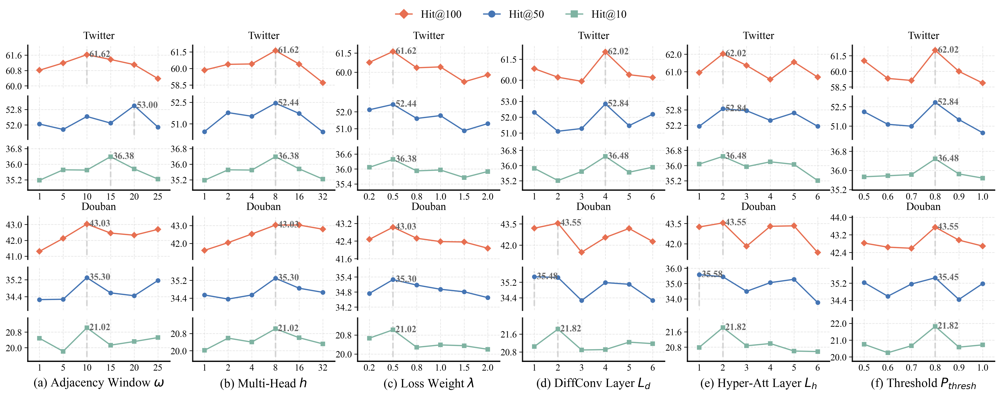
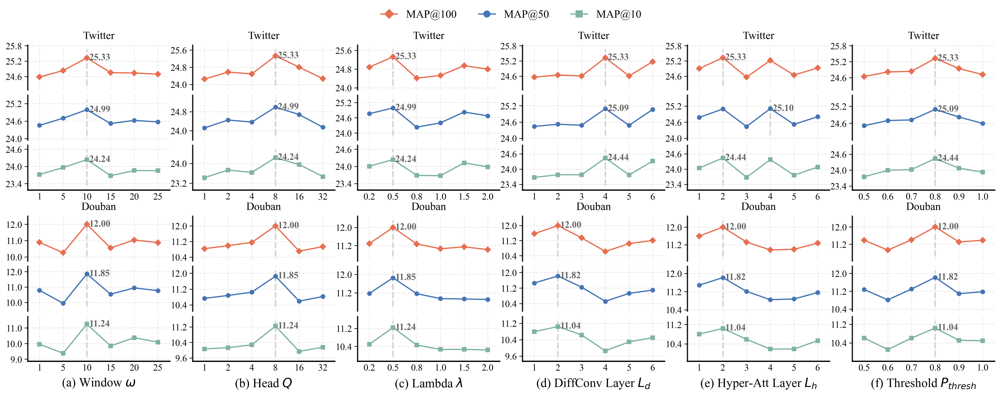
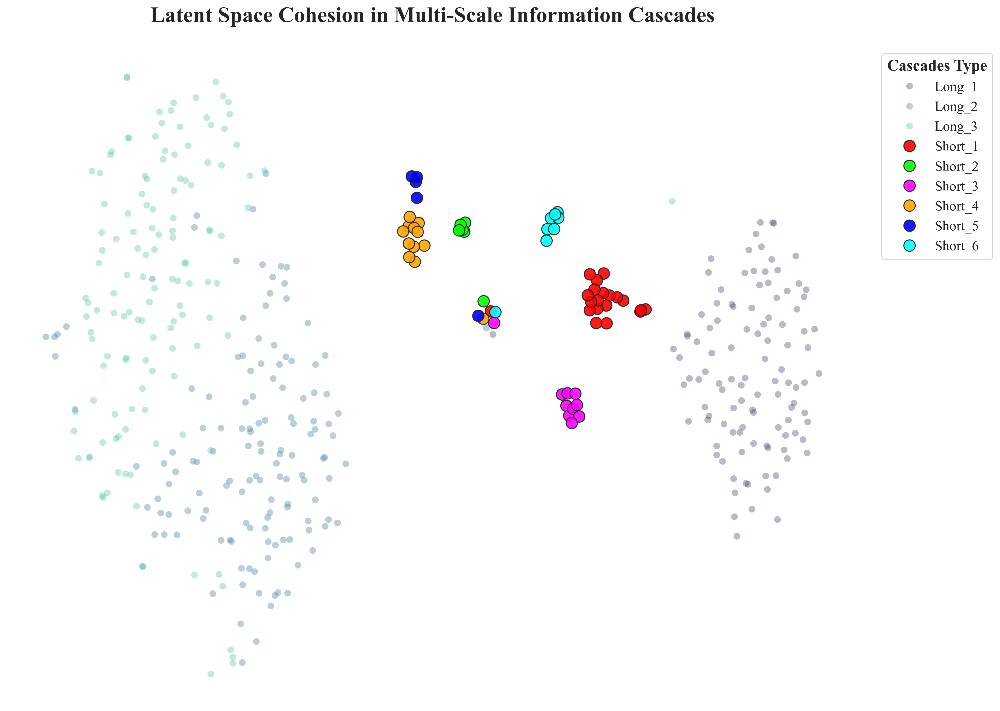
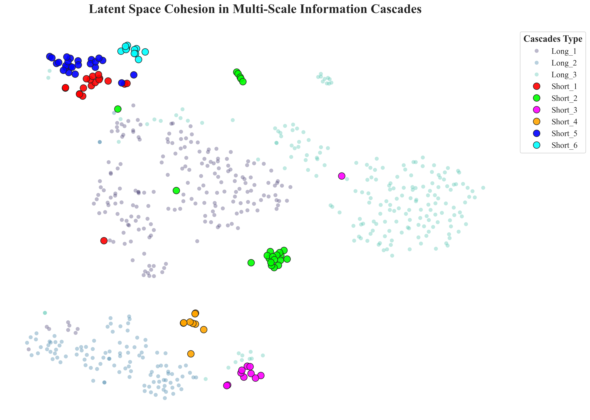

# Our model

## Main Experimental Results

To view our detailed result analysis and architecture visualization, please refer to the following figures:

### 1. Overall System Architecture
This is the overall system architecture.


### 2. Overall Performance
Below is the detailed quantitative comparison. 

<table style="width:85%; table-layout:fixed; border-collapse:collapse;">
  <thead>
    <tr>
      <th rowspan="2" style="width:6%; text-align:center;">Models</th>
      <th colspan="3" style="width:14%; text-align:center;">Twitter</th>
      <th colspan="3" style="width:14%; text-align:center;">Douban</th>
      <th colspan="3" style="width:14%; text-align:center;">Memetracker</th>
      <th colspan="3" style="width:14%; text-align:center;">Android</th>
      <th colspan="3" style="width:14%; text-align:center;">Christianity</th>
    </tr>
    <tr>
      <th style="width:4%; text-align:center;">Hits@10</th>
      <th style="width:4%; text-align:center;">Hits@50</th>
      <th style="width:4%; text-align:center;">Hits@100</th>
      <th style="width:4%; text-align:center;">Hits@10</th>
      <th style="width:4%; text-align:center;">Hits@50</th>
      <th style="width:4%; text-align:center;">Hits@100</th>
      <th style="width:4%; text-align:center;">Hits@10</th>
      <th style="width:4%; text-align:center;">Hits@50</th>
      <th style="width:4%; text-align:center;">Hits@100</th>
      <th style="width:4%; text-align:center;">Hits@10</th>
      <th style="width:4%; text-align:center;">Hits@50</th>
      <th style="width:4%; text-align:center;">Hits@100</th>
      <th style="width:4%; text-align:center;">Hits@10</th>
      <th style="width:4%; text-align:center;">Hits@50</th>
      <th style="width:4%; text-align:center;">Hits@100</th>
    </tr>
  </thead>
  <tbody>
    <tr>
      <td align="left">Topo-LSTM</td>
      <td align="center">0.1045</td><td align="center">0.1889</td><td align="center">0.2542</td>
      <td align="center">0.0897</td><td align="center">0.1633</td><td align="center">0.2157</td>
      <td align="center">0.1253</td><td align="center">0.2463</td><td align="center">0.3601</td>
      <td align="center">0.0456</td><td align="center">0.1263</td><td align="center">0.1653</td>
      <td align="center">0.1228</td><td align="center">0.2263</td><td align="center">0.3152</td>
    </tr>
    <tr>
      <td align="left">NDM</td>
      <td align="center">0.1788</td><td align="center">0.2570</td><td align="center">0.2996</td>
      <td align="center">0.0728</td><td align="center">0.1462</td><td align="center">0.1926</td>
      <td align="center">0.2083</td><td align="center">0.3663</td><td align="center">0.4583</td>
      <td align="center">0.0485</td><td align="center">0.1424</td><td align="center">0.1897</td>
      <td align="center">0.1541</td><td align="center">0.3136</td><td align="center">0.4586</td>
    </tr>
    <tr>
      <td align="left">FOREST</td>
      <td align="center">0.3136</td><td align="center">0.4283</td><td align="center">0.4984</td>
      <td align="center">0.1301</td><td align="center">0.2415</td><td align="center">0.3079</td>
      <td align="center">0.2794</td><td align="center">0.4523</td><td align="center">0.5415</td>
      <td align="center">0.0968</td><td align="center">0.1773</td><td align="center">0.2408</td>
      <td align="center">0.2485</td><td align="center">0.4201</td><td align="center">0.5128</td>
    </tr>
    <tr>
      <td align="left">Inf-VAE</td>
      <td align="center">0.1493</td><td align="center">0.3352</td><td align="center">0.4642</td>
      <td align="center">0.1094</td><td align="center">0.2102</td><td align="center">0.3472</td>
      <td align="center">0.2124</td><td align="center">0.4077</td><td align="center">0.4934</td>
      <td align="center">0.0598</td><td align="center">0.1470</td><td align="center">0.2091</td>
      <td align="center">0.1838</td><td align="center">0.3850</td><td align="center">0.5105</td>
    </tr>
    <tr>
      <td align="left">DyHGCN</td>
      <td align="center">0.2864</td><td align="center">0.4753</td><td align="center">0.5763</td>
      <td align="center">0.1673</td><td align="center">0.2871</td><td align="center">0.3618</td>
      <td align="center">0.2960</td><td align="center">0.4956</td><td align="center">0.5845</td>
      <td align="center">0.0667</td><td align="center">0.1634</td><td align="center">0.2478</td>
      <td align="center">0.2662</td><td align="center">0.4280</td><td align="center">0.5247</td>
    </tr>
    <tr>
      <td align="left">MS-HGAT</td>
      <td align="center">0.3094</td><td align="center">0.4712</td><td align="center">0.5671</td>
      <td align="center">0.2016</td><td align="center">0.3446</td><td align="center">0.4064</td>
      <td align="center">0.2877</td><td align="center">0.5013</td><td align="center">0.6082</td>
      <td align="center">0.1070</td><td align="center">0.1979</td><td align="center">0.2695</td>
      <td align="center">0.2879</td><td align="center">0.4635</td><td align="center">0.5463</td>
    </tr>
    <tr>
      <td align="left">RotDiff</td>
      <td align="center">0.3504</td><td align="center">0.5121</td><td align="center">0.6130</td>
      <td align="center">0.2013</td><td align="center">0.3453</td><td align="center">0.4238</td>
      <td align="center">0.2931</td><td align="center">0.5072</td><td align="center">0.6079</td>
      <td align="center"><strong>0.1119</strong></td><td align="center"><strong>0.2269</strong></td><td align="center"><strong>0.3147</strong></td>
      <td align="center"><strong>0.3371</strong></td><td align="center"><strong>0.5335</strong></td><td align="center"><strong>0.6585</strong></td>
    </tr>
    <tr>
      <td align="left">MIM</td>
      <td align="center">0.3514</td><td align="center">0.5198</td><td align="center">0.6213</td>
      <td align="center">0.1979</td><td align="center">0.3496</td><td align="center">0.4267</td>
      <td align="center">0.3021</td><td align="center">0.5196</td><td align="center">0.6306</td>
      <td align="center">0.1088</td><td align="center">0.2036</td><td align="center">0.2758</td>
      <td align="center">0.3170</td><td align="center"><u>0.5313</u></td><td align="center">0.6138</td>
    </tr>
    <tr>
      <td align="left">SDVD</td>
      <td align="center"><strong>0.3771</strong></td><td align="center"><strong>0.5463</strong></td><td align="center"><strong>0.6374</strong></td>
      <td align="center"><strong>0.2310</strong></td><td align="center"><strong>0.3816</strong></td><td align="center"><strong>0.4594</strong></td>
      <td align="center"><u>0.3143</u></td><td align="center"><strong>0.5349</strong></td><td align="center"><strong>0.6427</strong></td>
      <td align="center"><u>0.1111</u></td><td align="center"><u>0.2246</u></td><td align="center"><u>0.3046</u></td>
      <td align="center"><u>0.3259</u></td><td align="center"><strong>0.5335</strong></td><td align="center"><u>0.6540</u></td>
    </tr>
    <tr>
      <td align="left">Metacas</td>
      <td align="center"><u>0.3693</u></td><td align="center"><u>0.5372</u></td><td align="center"><u>0.6312</u></td>
      <td align="center">0.1997</td><td align="center">0.3402</td><td align="center">0.4209</td>
      <td align="center"><strong>0.3162</strong></td><td align="center"><u>0.5260</u></td><td align="center">0.6165</td>
      <td align="center">0.1021</td><td align="center">0.2002</td><td align="center">0.2666</td>
      <td align="center">0.3143</td><td align="center">0.5292</td><td align="center">0.6323</td>
    </tr>
    <tr style="background-color: #f6f8fa;">
      <td align="left"><strong>Ours</strong></td>
      <td align="center">0.3648</td><td align="center">0.5284</td><td align="center">0.6202</td>
      <td align="center"><u>0.2182</u></td><td align="center"><u>0.3545</u></td><td align="center"><u>0.4355</u></td>
      <td align="center">0.3091</td><td align="center">0.5245</td><td align="center"><u>0.6290</u></td>
      <td align="center">0.1057</td><td align="center">0.2066</td><td align="center">0.2922</td>
      <td align="center">0.2790</td><td align="center">0.5022</td><td align="center">0.6138</td>
    </tr>
  </tbody>
</table>

<table style="width:85%; table-layout:fixed; border-collapse:collapse;">
  <thead>
    <tr>
      <th rowspan="2" style="width:6%; text-align:center;">Models</th>
      <th colspan="3" style="width:14%; text-align:center;">Twitter</th>
      <th colspan="3" style="width:14%; text-align:center;">Douban</th>
      <th colspan="3" style="width:14%; text-align:center;">Memetracker</th>
      <th colspan="3" style="width:14%; text-align:center;">Android</th>
      <th colspan="3" style="width:14%; text-align:center;">Christianity</th>
    </tr>
    <tr>
      <th style="width:4%; text-align:center;">MAP@10</th>
      <th style="width:4%; text-align:center;">MAP@50</th>
      <th style="width:4%; text-align:center;">MAP@100</th>
      <th style="width:4%; text-align:center;">MAP@10</th>
      <th style="width:4%; text-align:center;">MAP@50</th>
      <th style="width:4%; text-align:center;">MAP@100</th>
      <th style="width:4%; text-align:center;">MAP@10</th>
      <th style="width:4%; text-align:center;">MAP@50</th>
      <th style="width:4%; text-align:center;">MAP@100</th>
      <th style="width:4%; text-align:center;">MAP@10</th>
      <th style="width:4%; text-align:center;">MAP@50</th>
      <th style="width:4%; text-align:center;">MAP@100</th>
      <th style="width:4%; text-align:center;">MAP@10</th>
      <th style="width:4%; text-align:center;">MAP@50</th>
      <th style="width:4%; text-align:center;">MAP@100</th>
    </tr>
  </thead>
  <tbody>
    <tr>
      <td align="left">Topo-LSTM</td>
      <td align="center">0.0951</td><td align="center">0.1368</td><td align="center">0.1468</td>
      <td align="center">0.0667</td><td align="center">0.0763</td><td align="center">0.0788</td>
      <td align="center">0.0623</td><td align="center">0.0675</td><td align="center">0.0698</td>
      <td align="center">0.0360</td><td align="center">0.0405</td><td align="center">0.0406</td>
      <td align="center">0.0793</td><td align="center">0.0867</td><td align="center">0.0986</td>
    </tr>
    <tr>
      <td align="left">NDM</td>
      <td align="center">0.1224</td><td align="center">0.1250</td><td align="center">0.1266</td>
      <td align="center">0.0339</td><td align="center">0.0372</td><td align="center">0.0379</td>
      <td align="center">0.1059</td><td align="center">0.1131</td><td align="center">0.1144</td>
      <td align="center">0.0201</td><td align="center">0.0222</td><td align="center">0.0293</td>
      <td align="center">0.0741</td><td align="center">0.0768</td><td align="center">0.0786</td>
    </tr>
    <tr>
      <td align="left">FOREST</td>
      <td align="center">0.1681</td><td align="center">0.1736</td><td align="center">0.1742</td>
      <td align="center">0.0841</td><td align="center">0.1073</td><td align="center">0.1077</td>
      <td align="center">0.1492</td><td align="center">0.1582</td><td align="center">0.1601</td>
      <td align="center">0.0583</td><td align="center">0.0617</td><td align="center">0.0626</td>
      <td align="center">0.1464</td><td align="center">0.1545</td><td align="center">0.1558</td>
    </tr>
    <tr>
      <td align="left">Inf-VAE</td>
      <td align="center">0.1983</td><td align="center">0.2068</td><td align="center">0.2182</td>
      <td align="center">0.0732</td><td align="center">0.0798</td><td align="center">0.0803</td>
      <td align="center">0.1345</td><td align="center">0.1379</td><td align="center">0.1446</td>
      <td align="center">0.0482</td><td align="center">0.0486</td><td align="center">0.0527</td>
      <td align="center">0.0925</td><td align="center">0.1196</td><td align="center">0.1245</td>
    </tr>
    <tr>
      <td align="left">DyHGCN</td>
      <td align="center">0.1795</td><td align="center">0.1842</td><td align="center">0.1896</td>
      <td align="center">0.0956</td><td align="center">0.0998</td><td align="center">0.1034</td>
      <td align="center">0.1532</td><td align="center">0.1635</td><td align="center">0.1652</td>
      <td align="center">0.0379</td><td align="center">0.0420</td><td align="center">0.0431</td>
      <td align="center">0.1556</td><td align="center">0.1630</td><td align="center">0.1664</td>
    </tr>
    <tr>
      <td align="left">MS-HGAT</td>
      <td align="center">0.1892</td><td align="center">0.1966</td><td align="center">0.1980</td>
      <td align="center">0.1024</td><td align="center">0.1078</td><td align="center">0.1103</td>
      <td align="center">0.1506</td><td align="center">0.1597</td><td align="center">0.1628</td>
      <td align="center">0.0634</td><td align="center">0.0672</td><td align="center">0.0682</td>
      <td align="center">0.1726</td><td align="center">0.1808</td><td align="center">0.1819</td>
    </tr>
    <tr>
      <td align="left">RotDiff</td>
      <td align="center">0.2241</td><td align="center">0.2318</td><td align="center">0.2232</td>
      <td align="center">0.1098</td><td align="center">0.1154</td><td align="center">0.1173</td>
      <td align="center">0.1524</td><td align="center">0.1621</td><td align="center">0.1637</td>
      <td align="center"><u>0.0659</u></td><td align="center"><u>0.0709</u></td><td align="center"><u>0.0721</u></td>
      <td align="center">0.1904</td><td align="center">0.1989</td><td align="center">0.2006</td>
    </tr>
    <tr>
      <td align="left">MIM</td>
      <td align="center">0.2376</td><td align="center">0.2447</td><td align="center">0.2482</td>
      <td align="center">0.1041</td><td align="center">0.1113</td><td align="center">0.1124</td>
      <td align="center">0.1568</td><td align="center">0.1678</td><td align="center">0.1693</td>
      <td align="center">0.0629</td><td align="center">0.0669</td><td align="center">0.0679</td>
      <td align="center"><u>0.1974</u></td><td align="center"><u>0.2070</u></td><td align="center"><u>0.2082</u></td>
    </tr>
    <tr>
      <td align="left">SDVD</td>
      <td align="center"><u>0.2485</u></td><td align="center"><u>0.2563</u></td><td align="center"><u>0.2576</u></td>
      <td align="center"><strong>0.1254</strong></td><td align="center"><strong>0.1325</strong></td><td align="center"><strong>0.1336</strong></td>
      <td align="center">0.1622</td><td align="center">0.1723</td><td align="center">0.1738</td>
      <td align="center"><strong>0.0699</strong></td><td align="center"><strong>0.0744</strong></td><td align="center"><strong>0.0756</strong></td>
      <td align="center"><strong>0.1975</strong></td><td align="center"><strong>0.2072</strong></td><td align="center"><strong>0.2089</strong></td>
    </tr>
    <tr>
      <td align="left">Metacas</td>
      <td align="center"><strong>0.2523</strong></td><td align="center"><strong>0.2598</strong></td><td align="center"><strong>0.2614</strong></td>
      <td align="center">0.1047</td><td align="center">0.1113</td><td align="center">0.1124</td>
      <td align="center"><strong>0.1701</strong></td><td align="center"><strong>0.1783</strong></td><td align="center"><strong>0.1798</strong></td>
      <td align="center">0.0612</td><td align="center">0.0668</td><td align="center">0.0687</td>
      <td align="center">0.1905</td><td align="center">0.1999</td><td align="center">0.2012</td>
    </tr>
    <tr style="background-color: #f6f8fa;">
      <td align="left"><strong>Ours</strong></td>
      <td align="center">0.2444</td><td align="center">0.2509</td><td align="center">0.2533</td>
      <td align="center"><u>0.1104</u></td><td align="center"><u>0.1182</u></td><td align="center"><u>0.1200</u></td>
      <td align="center"><u>0.1642</u></td><td align="center"><u>0.1734</u></td><td align="center"><u>0.1753</u></td>
      <td align="center">0.0630</td><td align="center">0.0672</td><td align="center">0.0685</td>
      <td align="center">0.1826</td><td align="center">0.1938</td><td align="center">0.1974</td>
    </tr>
  </tbody>
</table>

### 3. Visualization

#### 3.1 Parameters Analysis(Add Pthreshold)
The figure below illustrates the parameter sensitivity of our proposed method on the Twitter and Douban datasets. We investigate the impact of six key hyperparameters on the model's performance, measured by Hit@10, Hit@50, and Hit@100.




#### 3.2 Multi-scale Cas Latent Cohesion Analysis
The figures above provide a 2D visualization (e.g., via t-SNE) of the learned latent space representations for multi-scale information cascades. 

To evaluate the discriminative power of our representations, we map both long cascades (faded background points) and various types of short cascades (solid colored points). The visualization clearly demonstrates that our model effectively separates different cascade patterns. Notably, the short cascades are mapped into highly cohesive and distinct clusters, proving the model's superior capability in capturing robust and discriminative features across different diffusion scales.
<table align="center" style="border: none; width: 85%;">
  <tr align="center">
    <td style="border: none; width: 42%;">
      <strong style="font-size: 16px;">Twitter Dataset</strong>
      <br><br>
      
    </td>
    <td style="border: none; width: 42%;">
      <strong style="font-size: 16px;">Douban Dataset</strong>
      <br><br>
      
    </td>
  </tr>
</table>


# A PyTorch implementation of our Model.

## Dependencies
Install the dependencies via [Anaconda](https://www.anaconda.com/):
+ Python (>=3.10)
+ PyTorch (>=2.1.1)
+ NumPy (>=1.26.3)
+ Scipy (>=1.15.3)
+ torch-geometric(>=2.0.4)
+ networkx(>=3.3)


create virtual environment:
```
conda create --name Anomy_env python=3.10
```

activate environment:
```
conda activate Anomy_env
```

install pytorch from [pytorch](https://pytorch.org/get-started/previous-versions/):
```
conda install pytorch==2.1.1 torchvision==0.16.1 torchaudio==2.1.1 cudatoolkit=10.2 -c pytorch
```

To install all dependencies:
```
pip install -r requirements.txt
```

## Usage
Here we provide the implementation of our model along with twitter dataset.

+ To train and evaluate on Twitter:
```
python run.py -data_name twitter
```
More running options are described in the codes, e.g., `-data_name douban、memetracker`

## Folder Structure

Our model
```
└── data: # The file includes datasets
    ├── twitter
       ├── cascades.txt       # original data
       ├── cascadetrain.txt   # training set
       ├── cascadevalid.txt   # validation set
       ├── cascadetest.txt    # testing data
       ├── edges.txt          # social network
       ├── idx2u.pickle       # idx to user_id
       ├── u2idx.pickle       # user_id to idx
       
└── models: # The file includes each part of the modules in our model.
    ├── BYOL_net.py # The core source code of BYOL Self-supervised Net.
    ├── GDCN.py # The core source code of Diffusion Convolution Net.
    ├── HGAT.py # The core source code of Hypergraph Attention Net.
    ├── model.py # The core source code of our model.
    ├── TransformerBlock.py # The core source code of time-aware attention.

└── utils: # The file includes each part of basic modules (e.g., metrics, earlystopping).
    ├── EarlyStopping.py  # The core code of the early stopping operation.
    ├── graphConstruct.py # The core source code of building social network.
    ├── Metrics.py        # The core source code of metrics.
    ├── parsers.py        # The core source code of parameter settings. 
    ├── utils.py          # The core source code of tool functions.
└── Constants.py:     
└── dataLoader.py:     # Data loading.
└── run.py:            # Run the model.
└── Optim.py:          # Optimization.
